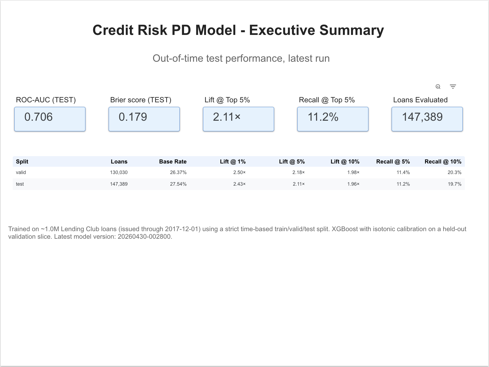
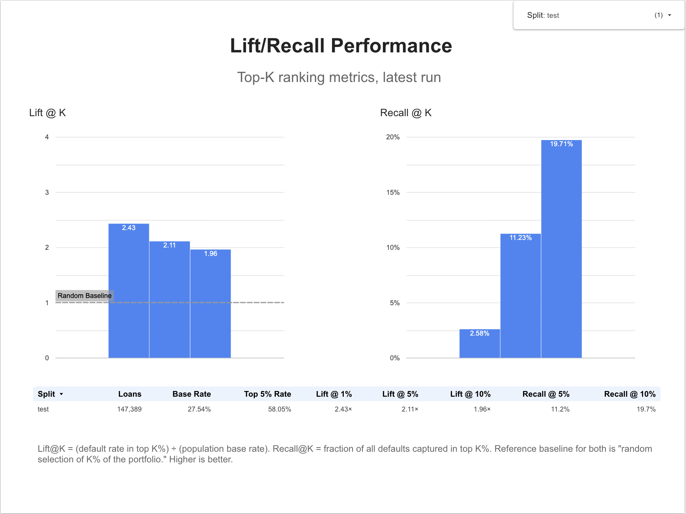
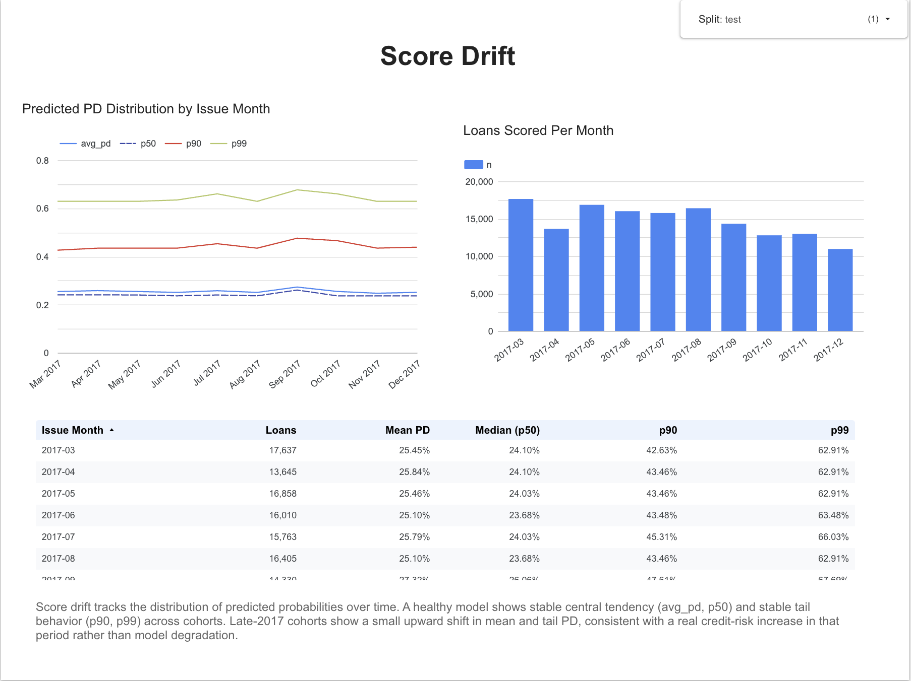
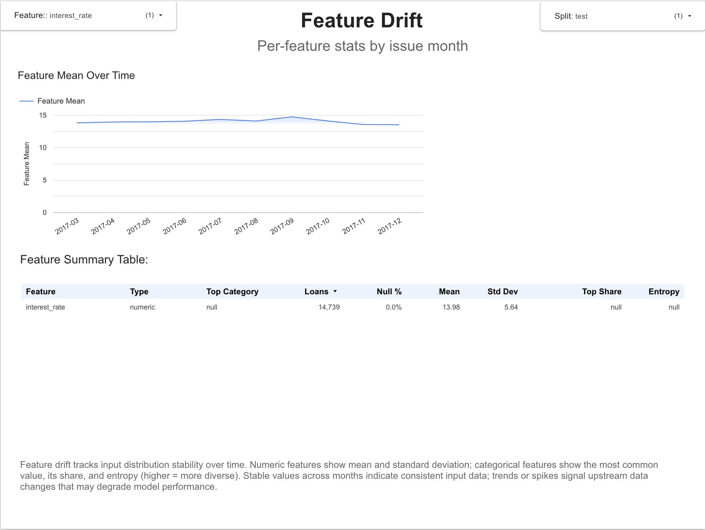
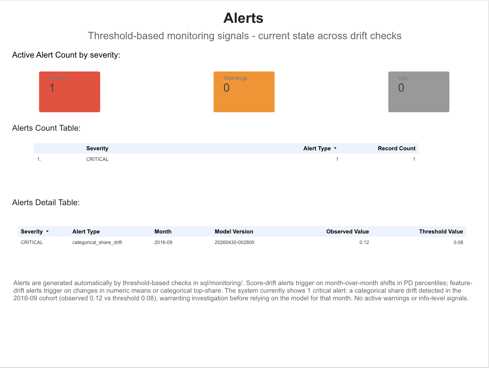

# Credit Risk Monitoring on GCP (BigQuery + XGBoost + Looker Studio)

End-to-end credit risk modeling and monitoring pipeline built on Google Cloud
Platform, using the Lending Club public dataset.

The project demonstrates a complete MLOps loop:

ingest → feature engineering (BigQuery SQL) → calibrated XGBoost model →
batch scoring → drift monitoring → threshold-based alerting → Looker Studio
dashboard.

The architecture is **BigQuery-first**: every artifact (features, predictions,
metrics, drift, alerts) lives in BigQuery, giving the system an auditable,
queryable history of every run.

---

## Latest results

Trained on full Lending Club public dataset (~1.3M loans, issued through
2017-12-01) using a strict time-based train / valid / test split.


| Metric | VALID | **TEST** |
|---|---|---|
| ROC-AUC | 0.6969 | **0.7063** |
| PR-AUC | 0.4347 | 0.4539 |
| Brier score | 0.1758 | 0.1792 |
| Base default rate | ~26% | ~28% |
| Top 5% default rate | 0.578 | 0.585 |
| Top 5% recall | 11.0% | 10.6% |
| **Lift @ 5%** | 2.19× | **2.12×** |

`Lift@5% = top 5% default rate / population base rate` — the top 5% of loans
ranked by predicted PD default at ~2.1× the population rate, which is useful
for review-capacity prioritization.

Model: XGBoost with isotonic-regression calibration on a held-out validation
slice; early stopping at 1,390 of 2,000 trees on validation logloss.

---

## What this project demonstrates

- **Time-based train / valid / test split** by `issue_date` (no leakage from
  the future)
- **Probability calibration** via isotonic regression on a held-out validation
  slice, using `CalibratedClassifierCV` with a `FrozenEstimator` wrapper to
  prevent the base model from being refit
- **Honest label handling for right-censoring**: loans with unrealised
  outcomes (`Current`, `In Grace Period`, etc.) are excluded; only matured
  loans contribute to training
- **Standard credit risk feature set** organized around the four pillars:
  capacity, credit history, utilization, velocity
- **Operational monitoring as a first-class concern**:
  - Ranking performance rollups (Lift@K, Recall@K)
  - Score drift (p50 / p90 / p99 / avg by month)
  - Feature drift (numeric stats + categorical share / entropy)
  - Threshold-based alerts written to BigQuery
- **GCP-native workflow**: BigQuery as the system of record, Looker Studio
  for visualization

See [`MODEL_CARD.md`](./MODEL_CARD.md) for the full label definition,
limitations, and methodology notes. See [`ARCHITECTURE.md`](./ARCHITECTURE.md)
for the data flow and table responsibilities.

---

## Repo structure

```
creditrisk-gcp/
├── README.md
├── ARCHITECTURE.md            # data flow + table responsibilities
├── MODEL_CARD.md              # label definition, metrics, limitations
├── run_monitoring.sh          # one-command monitoring refresh
├── start.sh                   # session bootstrap (gcloud config, env vars)
├── data/                      # local CSV input (loans.csv, gitignored)
├── artifacts/                 # trained model artifact (model.joblib, gitignored)
├── infra/
│   └── README_setup.md        # GCP project setup notes
├── sql/
│   ├── 01_create_tables.sql   # core BigQuery table DDL
│   ├── 02_build_features.sql  # feature engineering + label + time split
│   ├── 03_monitoring_tables.sql
│   ├── 04_feature_drift.sql   # feature-drift insert query
│   ├── 05_score_drift.sql
│   ├── 06_monitoring_rollups.sql
│   └── monitoring/
│       ├── 10_alert_score_p90.sql
│       ├── 11_alert_numeric_mean.sql
│       └── 12_alert_categorical_share.sql
└── src/
    ├── ingest/
    │   └── upload_and_load.py # CSV → BigQuery
    └── train/
        ├── train.py           # train + calibrate + write metrics
        ├── score_to_bigquery.py
        ├── evaluate.py
        └── requirements.txt
```

---

## Quickstart (Cloud Shell)

### 0) Bootstrap session
```bash
cd ~/creditrisk-gcp
source start.sh
```
This sets `gcloud` config, exports `PROJECT_ID` and `BQ_DATASET`, and
activates the Python virtual environment.

### 1) Python environment (first run only)
```bash
python -m venv .venv
source .venv/bin/activate
pip install -r src/train/requirements.txt
```

### 2) Create BigQuery tables (core + monitoring)
```bash
bq query --use_legacy_sql=false < sql/01_create_tables.sql
bq query --use_legacy_sql=false < sql/03_monitoring_tables.sql
```

### 3) Load raw dataset (CSV → BigQuery)
Place the Lending Club CSV at `data/loans.csv`, then:
```bash
python -m src.ingest.upload_and_load
```

### 4) Build features, label, and time split
```bash
bq query --use_legacy_sql=false < sql/02_build_features.sql
```
This produces `creditrisk.features` with the train / valid / test split.

### 5) Train calibrated model and log metrics
```bash
python src/train/train.py
```
Full run takes ~10–15 minutes on Cloud Shell. For a smoke test, set
`BQ_LIMIT=20000` to subsample.

### 6) Score valid + test into BigQuery
```bash
export SCORE_SPLIT=valid && python src/train/score_to_bigquery.py
export SCORE_SPLIT=test  && python src/train/score_to_bigquery.py
```

### 7) Run monitoring (one command)
```bash
chmod +x run_monitoring.sh
./run_monitoring.sh
```

---

## Key BigQuery outputs

### Core
- `creditrisk.loans_raw` — raw Lending Club dataset
- `creditrisk.features` — engineered features + label + time split
- `creditrisk.model_metrics` — evaluation metrics per training run (valid / test)
- `creditrisk.predictions` — scored PDs with `model_version`, `split`,
  `issue_date`, `ts`

### Monitoring
- `creditrisk.monitoring_rollups` (+ `_latest` view) — Lift@K / Recall@K
  rollups by run
- `creditrisk.score_drift` (+ `_latest` view) — PD distribution drift by month
- `creditrisk.feature_drift` (+ `_latest` view) — feature-level drift stats
  by month
- `creditrisk.monitoring_alerts` — threshold-based alerts (score and feature
  drift)

---

## Looker Studio dashboard

Five-page Looker Studio dashboard surfacing model performance and monitoring,
backed by BigQuery `_latest` views.

### Executive Summary


### Lift / Recall Performance


### Score Drift


### Feature Drift


### Alerts


---

## Methodology highlights

- **Calibration via `FrozenEstimator` (sklearn ≥ 1.6).** The base XGBoost
  pipeline is fit on the train split, then wrapped with `FrozenEstimator` so
  that `CalibratedClassifierCV` only fits the isotonic calibrator on top of
  the frozen base model's predictions on the valid split. This keeps train,
  calibrate, and test fully separated.
- **Maturity guard.** Only loans issued on or before `2017-12-01` are kept,
  so even 60-month-term loans have had ~7+ years to mature by the data
  snapshot date. Combined with excluding `Current` loans from the label,
  this avoids the right-censoring bias that inflates portfolio-grade
  Lending Club models.
- **Early stopping.** Training uses `n_estimators=2000` with
  `early_stopping_rounds=50` on validation logloss; the best iteration
  (~1,400 trees) is selected automatically.
- **Leakage discipline.** All post-origination Lending Club fields
  (`total_pymnt`, `recoveries`, `last_fico_range_*`, `hardship_*`,
  `settlement_*`, etc.) are excluded from features. See `MODEL_CARD.md` for
  the full list.

---

## Limitations
This is a portfolio / demonstration project. It is **not** intended for
production underwriting decisions. Notably:

- No fairness / disparate-impact evaluation
- No model explainability surface (SHAP, feature importance reports)
- No challenger model or A/B framework
- Manual model versioning (timestamps, no git SHA linkage or model registry)
- Training runs on Cloud Shell; production should use Vertex AI custom jobs
  or appropriately-sized Compute Engine VMs

See `MODEL_CARD.md` § Limitations for the complete list.

---

## Tech stack
- **Cloud:** Google Cloud Platform (BigQuery, Cloud Shell, Looker Studio)
- **Modeling:** Python, scikit-learn, XGBoost
- **Data:** Lending Club public loan-level dataset
- **Monitoring:** BigQuery SQL + Python orchestration
